# Folding twist, from first principles — 2-stack and 1+1+1

A self-contained walkthrough of the square-grid **twist criterion**: why a folded loop of
panels lies flat in stacks only when its *twist* vanishes, built up one step at a time. §1 is
the **2-stack** baseline (Yang–You–Rosen, RSPA 2025). §2 extends it to the **3-stack 1+1+1**
(I-shape) case this project targets.

All figures are idealized schematics generated by `gen.py` (matplotlib → SVG); the palette
matches the live tool (`grid.js`). Regenerate with `python3 gen.py`. Cross-references to the
paper figures (Fig 10–13) are the cases each schematic echoes.

---

## §0. The object: a loop of panels

We fold a tessellated plate. Each panel is a unit square; the fold pattern is a **Hamiltonian
circuit** (HC) on the grid graph. Folding it flat should produce compact **stacks**. Two
independent things can go wrong:

1. **Reflection** — the cut ends fail to rejoin (stacks unequal). *Separate condition; not
   covered here.*
2. **Twist** — even if the ends meet, the loop is **entangled** (self-linked) and cannot lie
   flat. **This is the twist criterion.**

Twist is a property of the *uncut, closed* loop.

---

## §1. Two-stack — the foundation

### 1.1 Tessellation → grid graph

Each panel becomes a node; panels sharing a side are joined by an edge. The fold pattern lives
on this graph.

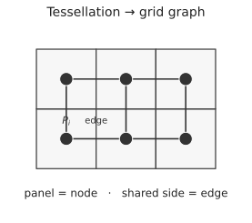

### 1.2 Hamiltonian circuit: creases vs slits

An HC visits every panel exactly once and closes up. The grid edges it **crosses** become
**creases** (folds, red); edges it does **not** cross become **slits** (gray). This turns an
over-constrained origami into a foldable kirigami.

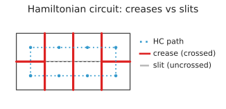

### 1.3 Folding = reflection

Folding panel `P_i` flat onto its neighbour `P_{i+1}` across their shared crease is exactly a
**mirror reflection** across the crease line. (Note the corner marker flips side — a reflection
reverses orientation.)

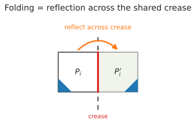

### 1.4 Two reflections = a rotation

Euclidean isometry: composing two reflections across lines meeting at angle `α` is a
**rotation by `2α`** about their intersection (across *parallel* lines it is a translation).
So folding `P_i → P_{i+1} → P_{i+2}` injects a local in-plane rotation `γ = 2α`.

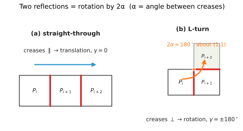

### 1.5 On a square, the only rotations are γ ∈ {0, ±180°}

Square creases are axis-aligned, so consecutive creases are either **parallel** (α = 0 →
γ = 0, straight-through) or **perpendicular** (α = 90° → γ = ±180°, an L-turn). The sign
distinguishes a left-L (`+180`) from a right-L (`−180`). Straight panels contribute nothing;
**only L-corners carry twist**. (Paper Fig 12a.)

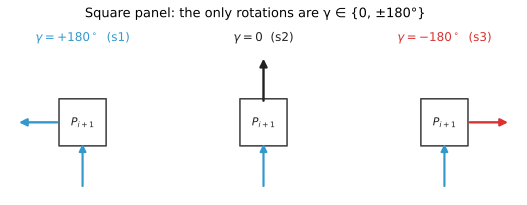

### 1.6 σ — the mountain/valley checkerboard

Folds alternate mountain/valley along the loop. Encode the direction as a sign
`σ = (−1)^{x+y}`: `+1` (valley) on even cells, `−1` (mountain) on odd cells. Because every unit
step flips `(x+y) mod 2`, this **checkerboard 2-colouring is exactly the alternation** the
paper assigns by HC position.

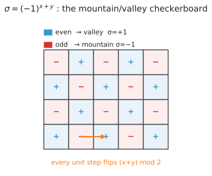

### 1.7 Local rotation g(i) = σ_i · γ_i

Same rotation magnitude can land `P_i` **under** or **over** `P_{i+2}` depending on fold order
(valley-then-mountain vs the reverse) → opposite twist sign. Multiply magnitude by direction:

$$ g(i) = \sigma_i \, \gamma_i $$

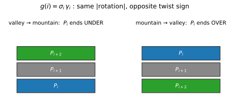

### 1.8 Odd # reflections = a flip = which stack

Each reflection has determinant `−1`, so after `k` folds the net map has `det = (−1)^k`.
**Even k** → proper, panel **face-up** (top stack); **odd k** → improper, **face-down**
(bottom stack). *The two stacks are precisely the even/odd reflection-count classes* — and σ
is exactly this parity.

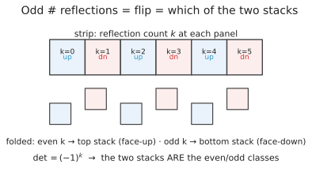

### 1.9 A valid loop is always even-length

The grid graph is **bipartite** (checkerboard), so any closed HC visiting all cells has
**even length `2n`** → an even number of reflections → the loop returns proper (face-up) and
closes consistently. A 2-stack loop can never terminate on a lone odd reflection.

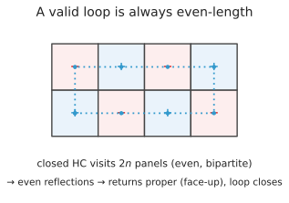

### 1.10 Twist, and a worked foldable case

Each crease sits in two consecutive local rotations (double-counted); summing, halving, and
normalising by `2π`:

$$ Tw = \frac{1}{4\pi} \sum_{i=1}^{2n} g(i)
      = \frac{1}{4\pi}\big(\mathrm{Odd}(\mathcal P) + \mathrm{Even}(\mathcal P)\big) $$

For 2×4 squares the four L-corners give `Odd = −2π`, `Even = +2π` → `Σg = 0` → **`Tw = 0`**:
foldable. (Paper Fig 13b.)

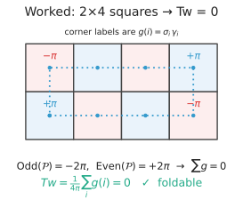

### 1.11 A worked twisted case

A square ring (3×3 with the centre removed) gives `Odd = 0`, `Even = +4π` → `Σg = 4π` →
**`Tw = +1`**: entangled, **not** foldable. (Paper Fig 13a.)

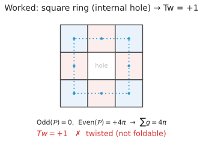

### 1.12 Why Tw = 0 is the exact condition — Călugăreanu–White–Fuller

For a closed ribbon, `Lk = Tw + Wr`, where the **linking number `Lk`** is a topological
invariant (cannot change without cutting), and **writhe `Wr`** measures spatial coiling of the
neutral axis.

- Flat start → `Lk = 0`. Rigid folding never cuts → `Lk = 0` throughout.
- Flat stacks → no coiling → `Wr = 0`.
- Therefore `0 = Tw + 0` → **`Tw = 0`**.

Any twist injected forces `Wr = −Tw ≠ 0` (the loop must coil) → entanglement. (Paper Fig 10:
a band twisted by `2π` has `Tw=1, Wr=0`; relaxing trades it to `Tw=0, Wr=1`, but `Lk=1`
throughout — the entanglement never leaves without a cut.)

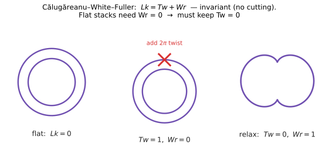

**Two-stack criterion:** foldable ⟺ reflection condition holds **and** `Tw = 0`.

---

## §2. Three-stack 1+1+1 — the extension

The 3-stack target splits the footprint into three 1-chains. Everything above is inherited;
only the *loop structure* changes.

### 2.1 Structures: simple loop vs theta graph

A 2-stack fold is a **simple loop** (cycle rank 1). A 1+1+1 fold has two **fused footprint
hubs** joined by three chains — a **theta graph** (cycle rank 2). The 2+1 case is the same
theta with one chain a 2-chain (the harder, still-open case).

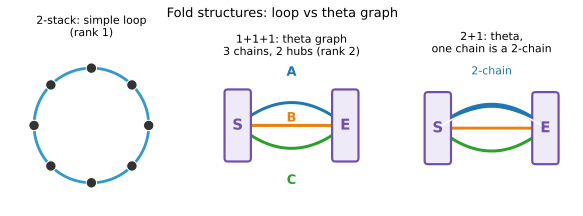

### 2.2 Theta anatomy

The start footprint `S` and exit footprint `E` are **rigid** (their internal creases are
fused). Chains A, B, C each run `S → E`. Cycle rank `= E − V + 1 = 3 − 2 + 1 = 2`: only **two
independent cycles**.

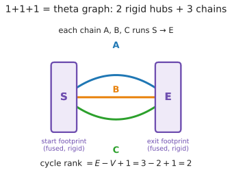

### 2.3 Pairwise loops

Every cycle in a theta graph is "one chain out, another chain back" — a **pairwise loop**
through both hubs. There are three (AB, AC, BC). Each is a genuine closed 2-stack-style loop,
so CWF demands `Tw = 0` on it. The criterion is therefore:

$$ \text{foldable} \iff \mathrm{Tw}(L_{AB}) = \mathrm{Tw}(L_{AC}) = \mathrm{Tw}(L_{BC}) = 0 $$

where each `Tw(L_{ij})` is the paper's closed-loop twist (§1.10) of the loop `L_{ij}` = chain
`i` (S→E) followed by chain `j` (E→S).

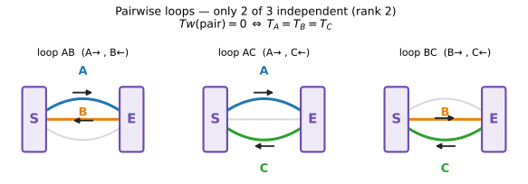

**Test all three — twist is not a homology class.** The theta graph has cycle rank 2, so
homologically `[L_{AC}] = [L_{AB}] + [L_{BC}]` and only two loops are independent. But twist is
a *geometric* invariant of an embedded loop, **not** additive over cycle sums:
`Tw(L_{AC}) ≠ Tw(L_{AB}) + Tw(L_{BC})` in general. So the third pairwise twist is genuinely
independent information and **all three must vanish** — checking a fixed independent pair would
miss the twisted solutions whose nonzero loop is the omitted one (empirically the twisted pair
is `BC` for the L footprint but `AC` for some Rect cases). This is exactly `search.py twist_check`.

> **Note (correction, 2026-06-04).** An earlier draft of §2.5 claimed the hub rotations let one
> write `Tw(L_{ij}) = T_i − T_j` for a per-chain scalar `T_i`, reducing the criterion to
> `T_A = T_B = T_C`. **That reduction is false** (disproved below in §2.5): twist of a pairwise
> loop is not a difference of per-chain potentials.

### 2.4 The chain-end orphan (Q8)

Along an open chain, reflections pair up into `g(i)` terms — except the **last** panel at the
hub, a single **unpaired** reflection (improper, no successor crease). This orphan is why a
naïve *per-chain* twist false-negatived. **Fused-hub closure** re-pairs the orphan: closing a
chain pair through the rigid hub restores an even, proper closed loop where `Tw` is defined.

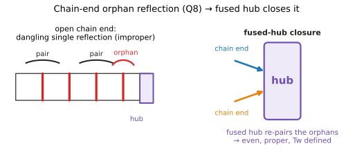

### 2.5 A tempting reduction that fails — global-σ per-chain twist

It is tempting to collapse §2.3 to a *per-chain* number. Define each chain's twist over its
interior corners with a **global** checkerboard sign `σ = (−1)^{x+y}`:

$$ T_i = \sum_{\text{interior L-corners of chain }i} \sigma(v)\,\gamma(v), \qquad
   \text{(proposed)}\ \ \text{foldable} \iff T_A = T_B = T_C $$

The idea: each pairwise loop's twist would be `T_i − T_j` (the shared S→E hub rotation
traversed forward in one chain and reverse in the other, cancelling), so foldability reduces to
the three per-chain values agreeing. **This is wrong.** Two independent disproofs, from
`py/analyze_twist.py` over the full cache (68 1+1+1 solutions, 6×6/12×4/9×4/6×4):

1. **Cocycle obstruction (fatal).** If `Tw(L_{ij}) = T_i − T_j`, the three pairwise twists must
   satisfy `Tw(L_{AB}) − Tw(L_{AC}) + Tw(L_{BC}) = 0`. Twisted solutions have e.g.
   `{AB:0, AC:0, BC:720}` ⇒ the sum is `720 ≠ 0`. No per-chain `T_i` can produce that — a
   pairwise loop carries twist that is *not* a difference of per-chain potentials. (This is the
   §2.3 "twist is not a homology class" point.)
2. **False negatives on foldable solutions.** Foldable pieces (all three pairwise loops `= 0`)
   yield disagreeing per-chain values such as `T = [0, 180, −180]` or `[180, 0, 0]`. The
   interior-corner sum is not invariant on its own — it drops the chain-end **orphan** /
   hub-closure terms (§2.4) that carry real twist.

Score: the correct **all-pairwise-loops-zero** criterion matches ground truth **68/68**; the
per-chain `T_A=T_B=T_C` proposal matches only **45/68**. **Use §2.3.** The per-chain form is
kept here only as a cautionary record.

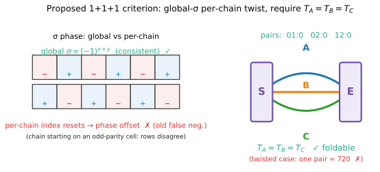

---

## §3. Summary

| step | 2-stack | 1+1+1 |
|---|---|---|
| structure | simple loop (rank 1) | theta graph (rank 2) |
| fold primitive | reflection across crease | same |
| local rotation | `γ = 2α ∈ {0, ±180°}` (square) | same |
| direction sign | `σ = (−1)^{x+y}` | same, **global** |
| invariant | `Tw = (1/4π) Σ g(i)` | `Tw(L_{ij})` per pairwise loop |
| foldable ⟺ | `Tw = 0` | `Tw(L_{AB}) = Tw(L_{AC}) = Tw(L_{BC}) = 0` (all 3) |
| basis | CWF `Lk = Tw + Wr` | CWF on each pairwise loop (twist not homological ⇒ test all 3) |
| open issue | — | 2+1 chain-order (Q1); per-chain reduction `T_A=T_B=T_C` disproved (§2.5) |

## References

- Yang, You, Rosen (2025), *Folding a tessellated uniform-thick plate into compact stacks*,
  Proc. R. Soc. A 481:20250696 — `resources/RSPA-2025-0696...pdf` (§3 reflection, §4 twist).
- Călugăreanu–White–Fuller: `Lk = Tw + Wr`.
- Project notes: `resources/twist_diagnosis.md`, `context.md` (twist criterion, Q1/Q8).
